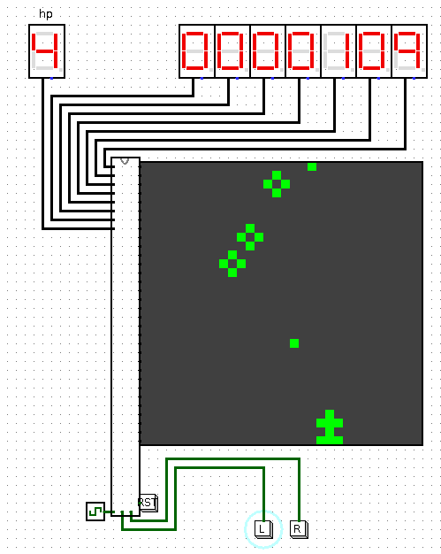

A simple downhill ski game implemented entirely in Logisim, using only digital logic components such as logic gates, flip-flops, counters, and multiplexers.

The player controls a skier who moves down the slope, collects points, and avoids obstacles. The score is displayed on seven-segment displays, and the game logic is implemented without any microcontroller, CPU, or software code.
